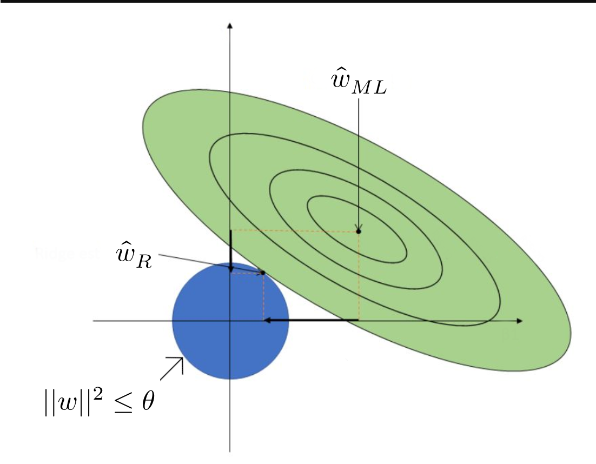

\title{MLT Week-6}
\author{Sherry Thomas \\ 21f3001449}

\maketitle
\tableofcontents

\begin{abstract}
In this week's discussion on Linear Regression, we explore various techniques to minimize Mean Squared Error (MSE) and delve into the concepts of Ridge and Lasso regression. These methods aim to optimize the performance of the linear regression model and improve its predictive power.
\end{abstract}

# Goodness of Maximum Likelihood Estimator for Linear Regression
Given a dataset $\{x_1, \ldots, x_n\}$ where $x_i \in \mathbb{R}^d$, let $\{y_1, \ldots, y_n\}$ be the labels, where $y_i \in \mathbb{R}$.
$$
y|X = w^Tx + \epsilon
$$
where $\epsilon \sim \mathcal{N}(0,\sigma^2)$ and $w \in \mathbb{R}^d$. Let $\hat{w}_{ML}$ signify the maximum likelihood parameter for linear regression.
$$
\hat{w}_{ML}=w^*=(XX^T)^+Xy
$$
$\therefore$ To measure how good our parameter is, we use the follow:
$$
\mathbb{E} [|| \hat{w}_{ML} - w ||^2_2]
$$
This is known as the Mean Squared Error (MSE) and turns out to be equal to
$$
\mathbb{E} [|| \hat{w}_{ML} - w ||^2_2] = \sigma^2 *trace((XX^T)^{-1})
$$

# Cross-Validation for Minimizing MSE
Let the eigenvalues of $XX^T$ be $\{\lambda_1, \ldots, \lambda_d\}$. Hence the eigenvalues of $(XX^T)^{-1}$ are $\{\frac{1}{\lambda_1}, \ldots, \frac{1}{\lambda_d}\}$. 

$\therefore$ The MSE is,
$$
\mathbb{E} [|| \hat{w}_{ML} - w ||^2_2] = \sigma^2 \sum_{i=1}^d  \frac{1}{\lambda_i}
$$
Consider the following estimator,
$$
\hat{w}_{new}=(XX^T + \lambda I)^{-1}Xy
$$
where $\lambda \in \mathbb{R}$ and $I \in \mathbb{R}^{d\times d}$ is the Identity Matrix. Using this we get,
$$
trace((XX^T + \lambda I)^{-1}) = \sum_{i=1}^d  \frac{1}{\lambda_i + \lambda}
$$
According to the Existence Theorem, $\exists\lambda$ s.t. $\hat{w}_{new}$ has lesser means square error than $\hat{w}_{ML}$.

In practice, we find $\lambda$ using **cross validation**.

Three popular techniques of Cross Validation are:

1. **Training-Validation Split**: The training set is randomly split into training and validation set, usually in the ratio $80:20$. From among various $\lambda$s, we choose the one with gives the least error.
2. **K-Fold Cross Validation**: It is done by dividing the training set into K equally-sized parts, training the model K times on different (K-1) parts, and evaluating it on the remaining part. From among various $\lambda$s, we choose the one with gives the least average error.
3. **Leave One Out Cross Validation**: It is done by training the model on all but one of the samples in the training set and evaluating it on the left-out sample, repeating this process for each sample in the dataset. From among various $\lambda$s, we choose the one with gives the least average error.

\newpage
# Bayesian Modeling
An alternate way to understand $\hat{w}_{ML}$ is through Bayesian Modeling.

Let $P(y|X)\sim \mathcal{N}(w^Tx,I)$. We use $I$, the identity matrix, instead of $\sigma^2$ for simplicity.

A good choice of prior for $w$ is $\mathcal{N}(0,\gamma^2I)$, where $\gamma\in\mathbb{R}^d$.

Therefore, we get,
\begin{align*}
P(w|\{(x_1, y_1), \ldots, (x_n,y_n)\})&\propto P(\{(x_1, y_1), \ldots, (x_n,y_n)\}|w)*P(w)\\
&\propto \left ( \prod _{i=1} ^n e^{\frac{-(y_i - w^Tx_i)^2}{2}}  \right ) * \left ( \prod _{i=1} ^d  e^{\frac{-(w_i - 0)^2}{2\gamma^2}} \right )\\
&\propto \left ( \prod _{i=1} ^n e^{\frac{-(y_i - w^Tx_i)^2}{2}}  \right ) * \left ( e^{-\sum _{i=1} ^d\frac{w_i^2}{2\gamma^2}} \right ) \\
&\propto \left ( \prod _{i=1} ^n e^{\frac{-(y_i - w^Tx_i)^2}{2}}  \right ) * e^{\frac{-||w||^2}{2\gamma^2}} \\
\log(P(w|\{(x_1, y_1), \ldots, (x_n,y_n)\}))&\propto \frac{-(y_i - w^Tx_i)^2}{2}-\frac{||w||^2}{2\gamma^2}
\end{align*}
$$
\text{Taking the gradient, we get}
$$
\begin{align*}
\nabla \log(P(w|\{(x_1, y_1), \ldots, (x_n,y_n)\}))&\propto  (XX^T)\hat{w}_{MAP} - Xy + \frac{\hat{w}_{MAP}}{\gamma^2} \\
\therefore \hat{w}_{MAP}&=(XX^T + \frac{1}{\gamma^2} I)^{-1}Xy
\end{align*}
where $\hat{w}_{MAP}$ is the Maximum a posteriori Estimate. In practice, the value for $\frac{1}{\gamma^2}$ is acquired using cross validation.

Hence, Maximum a posteriori Estimation for linear regression with a Gaussian Prior $\mathcal{N}(0,\gamma^2I)$ for $w$ is equivalent to the "new" estimator we used previously.

# Ridge Regression
Ridge regression is a type of linear regression that adds a penalty term to the ordinary least squares method to mitigate multicollinearity and overfitting.

Its objective function is given by,
$$
\min_{w\in \mathbb{R}^d} \sum^n_{i=1}(w^Tx_i-y_i)^2 + \lambda||w||_2^2
$$
where $\lambda||w||_2^2$ is the regularizer, and $||w||_2^2$ is the squared L2 Norm of $w$. Let this equation be given by $f(w)$.

Subsequently, this is also equivalent to,
$$
\min_{w\in \mathbb{R}^d} \sum^n_{i=1}(w^Tx_i-y_i)^2 \hspace{1em}\text{s.t.}||w||_2^2\le\theta
$$
where $\theta$ is dependent on $\lambda$.

In conclusion, for every choice of $\lambda>0$, $\exists \theta$ s.t. there are optimal solutions to our objective function.

The loss function of the linear regression of $w_{ML}$ is given by,
$$
f(w_{ML}) = \sum^n_{i=1}(w_{ML}^Tx_i-y_i)^2
$$
Consider the set of all $w$ s.t. $f(w_{ML}) = f(w) + c$ where $c>0$. This set is given by,
$$
S_c = \left \{w: f(w_{ML}) = f(w) + c \right \} 
$$
i.e. every $w \in S_c$ satisfies,
$$
||X^Tw-y||^2=||X^Tw_{ML}-y||^2 + c
$$
$$
\text{On Simplification, we get}
$$
$$
(w-w_{ML})^T(XX^T)(w-w_{ML}) = c'
$$
where $c'$ depends on $c,XX^T,$ and $w_{ML}$, but **not on** $w$.

**Conclusion**: Ridge Regression pushes feature values to zero but not necessarily zero.

# Lasso Regression
**Lasso (Least Absolute Shrinkage and Selection Operator)** regression is a type of linear regression that uses a regularization technique to shrink the coefficients of the less important features to zero, effectively performing feature selection and preventing overfitting.

Its objective function is given by,
$$
\min_{w\in \mathbb{R}^d} \sum^n_{i=1}(w^Tx_i-y_i)^2 + \lambda||w||_1^2
$$

As you can see, it is almost the same as Ridge Regression. The only difference is that it uses $||w||_1^2$, instead of $||w||_2^2$, which is the squared L1 norm of $w$.

Lasso Regression does not have a closed form solution and is often solved using Sub-gradients. For further info on sub-gradients, see [here](https://see.stanford.edu/materials/lsocoee364b/01-subgradients_notes.pdf).

**Conclusion**: Lasso Regression pushes less important features to zero.

# Credits
Professor Arun Rajkumar: The content as well as the notations are from his slides and lecture.