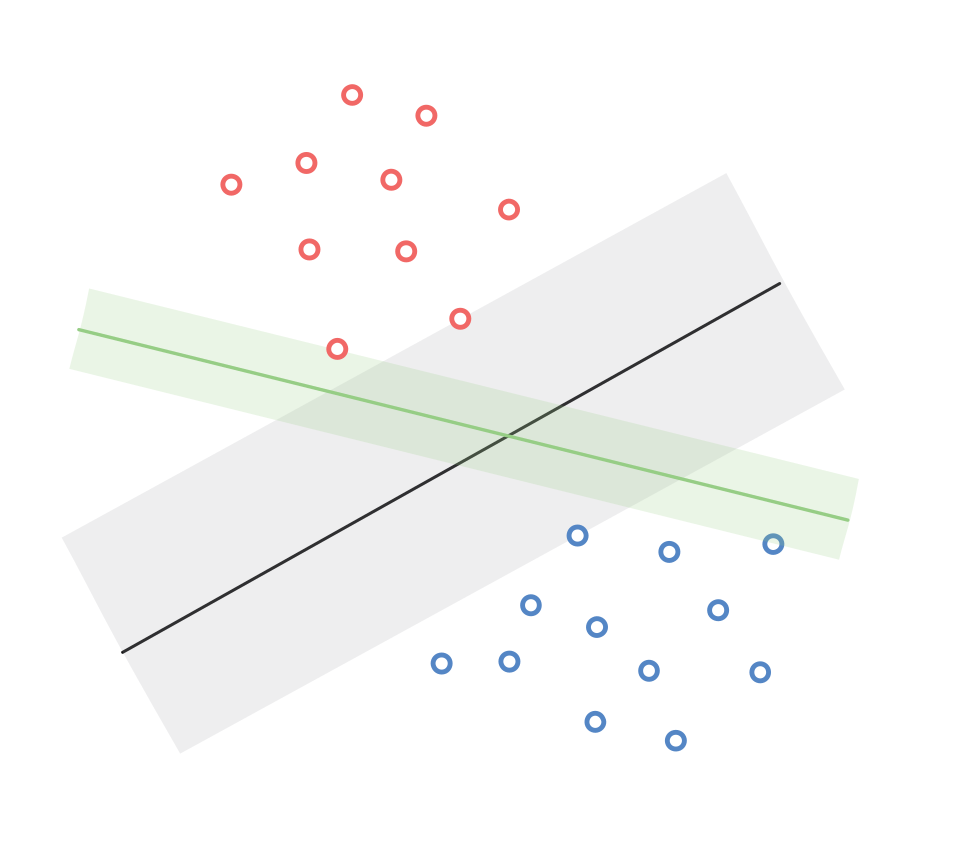
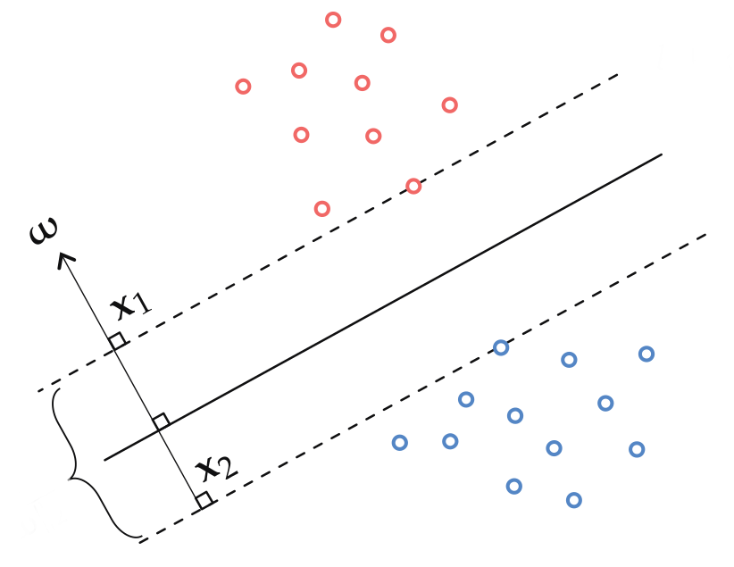

\title{MLT Week-10}
\author{Sherry Thomas \\ 21f3001449}

\maketitle
\tableofcontents

\begin{abstract}
This week's curriculum entails a further examination of the perceptron algorithm, followed by a comprehensive exploration of support vector machines (SVM) and subsequently, an elaboration on the concept of soft-margin SVM.
\end{abstract}

# Perceptron and Margins
Let dataset $D=\{(x_1, y_1), \ldots, (x_n,y_n)\}$ be linearly separable with $\gamma$-margin where $x_i \in \mathbb{R}^d$ and $y_i \in \{-1, 1\}$.

Let $w^* \in \mathbb{R}^d$ be the weight vector s.t. $(w^{*T}x_i)y_i\ge\gamma$ $\forall i$.

Let some $R>0 \in \mathbb{R}$, s.t. $\forall i$ $||x_i||\le R$.

Therefore, the number of mistakes made by the algorithm is given by,
$$
\text{\#mistakes} \le \frac{R^2}{\gamma^2}
$$

\newpage
**Observations**

Let $w_{perc}$ be any weight vector which can linearly separate the dataset.

Therefore, we observe the following:

1. "Quality" of the solution depends on the margin.
2. Number of mistakes depend on $w^*$'s margin.
3. $w_{perc}$ need not necessarily be $w^*$.

Hence, our **goal** should be to **find the solution that maximizes the margin**.

## Margin Maximization
From the previous analysis, it is clear that a single dataset could have multiple linear classifiers with varying margins. The following diagram illustrates this phenomenon,

{width=70%}

Therefore, for getting the best classifier, our goal can be written as,
$$
\max_{w,\gamma} \gamma
$$
\begin{align*}
s.t. (w^Tx_i)y_i &\ge \gamma \hspace{1em} \forall i \\
||w||^2 &= 1\
\end{align*}
The boundary of the margin is given by,
\begin{align*}
\{x:(w^Tx_i)y_i &= \gamma\}\\
\{x:(\frac{w}{\gamma}^Tx_i)y_i &= 1\}\\
\end{align*}
From the above equation, we can see that $\gamma$ depends on the width of $w$. Therefore, we reformulate our goal as,
$$
\max_{w} \text{width}(w)
$$
\begin{align*}
s.t. (w^Tx_i)y_i &\ge 1 \hspace{1em} \forall i \\
\end{align*}
Let the width be the distance between the two parallel margins, and let $x$ and $z$ be two points who are on the two lines exactly opposite to each other s.t. $w^Tx=-1$ and $w^Tz=1$ or vice versa.

Let $x_1$ and $x_2$ be two points which lie on opposite side of the decision boundary as well as on the margins. 

{width=70%}

Therefore, the width is given by,
\begin{align*}
x_1^Tw - x_2^Tw &= 2 \\
(x_1-x_2)^Tw &= 2\\
|x_1 - x_2||_2||w||_2 \cos(\theta) &= 2 \\ 
\therefore ||x_1 - x_2||_2 &= \frac{2}{||w||_2}
\end{align*}

Therefore, our objective function can be written as,
$$
\max_{w}  \frac{2}{||w||^2_2} \hspace{1em} s.t. (w^Tx_i)y_i \ge 1 \hspace{1em} \forall i
$$
Equivalently,
$$
\min_{w}  \frac{1}{2}||w||^2_2 \hspace{1em} s.t. (w^Tx_i)y_i \ge 1 \hspace{1em} \forall i
$$
Therefore finding the separating hyperplane with maximum margin is equivalent to finding the one with the smallest possible normal vector $w$.

# Constrained Optimization
Let a constrained optimization problem be formulated as follows,
\begin{align*}
\min_w f(w) \\
s.t. g(w) \le 0 \\
\end{align*}
We can solve this problem using **Lagrange Multipliers**.

Lagrange multipliers are used in constrained optimization problems to find the optimal values of the objective function subject to a set of constraints. In Lagrange multipliers method, the constraints are incorporated into the objective function by introducing additional variables called Lagrange multipliers.

The Lagrange function $\mathcal{L}(x, \alpha)$, for our above function, is defined as follows:
$$
\mathcal{L}(w, \alpha) = f(w) + \alpha g(w) \hspace{1em} \forall w
$$
where $\alpha \ge 0$.

Therefore, maximizing the Lagrange function w.r.t. $\alpha$,
\begin{align*}
\max_{\alpha\ge0} \mathcal{L}(w, \alpha) &= \max_{\alpha\ge0} f(w) + \alpha g(w) \\
&=
\begin{cases}
\infty \hspace{2em} \text{if} \hspace{1em} g(w) > 0 \\
f(w) \hspace{1em} \text{if} \hspace{1em} g(w) \le 0
\end{cases}
\end{align*}
As the Lagrange function is equal to $f(w)$ where $g(w) \le 0$, we can rewrite our original function as,
\begin{align*}
\min_w f(w) &= \min_w \left [ \max_{\alpha\ge0} \mathcal{L}(w, \alpha) \right ] \\
&= \min_w \left [ \max_{\alpha\ge0} f(w) + \alpha g(w) \right ] \\
\end{align*}
In general, we cannot swap the min and max functions unless all the functions involved are convex functions. Hence, as both $f$ and $g$ are convex functions in our example, we can rewrite them as follows,
$$
\min_w \left [ \max_{\alpha\ge0} f(w) + \alpha g(w) \right ] \equiv \max_{\alpha\ge0} \left [ \min_w f(w) + \alpha g(w) \right ]
$$
Let's rewrite the above constrained optimization problem with $m$ constraints $g_i(w) \le 0$ where $i \in [1, m]$. This can written as,
\begin{align*}
\min_w f(w) &\equiv \min_w \left [ \max_{\alpha\ge0} f(w) + \sum _{i=1} ^m \alpha _i g_i(w) \right ] \\
&\equiv \max_{\alpha\ge0} \left [ \min_w f(w) + \sum _{i=1} ^m \alpha _i g_i(w) \right ] \\
\end{align*}

# Formulating the Dual Problem
Our Objective function is as follows,
$$
\min_{w}  \frac{1}{2}||w||^2_2 \quad s.t. (w^Tx_i)y_i \ge 1 \quad \forall i
$$
The constraints can be written as follows,
\begin{align*}
(w^Tx_i)y_i &\ge 1 \quad \forall i \\
1 - (w^Tx_i)y_i &\le 0 \quad \forall i \\
\end{align*}
Let $\alpha \in \mathbb{R}^d$ be the Lagrange multipliers, and let our Lagrange function be written as,
\begin{align*}
\mathcal{L}(w, \alpha) &= \frac{1}{2}||w||^2_2 + \sum _{i=1} ^n \alpha _i (1 - (w^Tx_i)y_i) \\
\min_w \max_{\alpha\ge0} \left [ \frac{1}{2}||w||^2_2 + \sum _{i=1} ^n \alpha _i (1 - (w^Tx_i)y_i) \right ] &\equiv \max_{\alpha\ge0} \min_w \left [ \frac{1}{2}||w||^2_2 + \sum _{i=1} ^n \alpha _i (1 - (w^Tx_i)y_i) \right ]
\end{align*}
Solving for the inner function of the dual problem, we get, \begin{align*}
w_{\alpha}^* - \sum _{i=1} ^n \alpha _i x_i y_i = 0 \\
\therefore w_{\alpha}^* = \sum _{i=1} ^n \alpha _i x_i y_i
\end{align*}
Rewriting the above equation in vectorized form, we get,
$$
w_{\alpha}^* = XY\alpha \quad \ldots[1]
$$
where $X \in \mathbb{R}^{d \times n}$, $Y \in \mathbb{R}^{n \times n}$, and $\alpha \in \mathbb{R}^{n}$. $X$ is the dataset, $Y$ is the label diagonal matrix, where the diagonals are the labels.
Rewriting the outer dual function, we get,
\begin{align*}
&\max_{\alpha\ge0} \left[ \frac{1}{2}||w||^2_2 + \sum _{i=1} ^n \alpha _i (1 - (w^Tx_i)y_i) \right] \\
&= \max_{\alpha\ge0} \left[ \frac{1}{2}w^Tw + \sum _{i=1} ^n \alpha_i -  w^TXY\alpha \right] \\
&= \max_{\alpha\ge0} \left[ \frac{1}{2}(XY\alpha)^TXY\alpha + \sum _{i=1} ^n \alpha_i -  (XY\alpha)^TXY\alpha \right] \quad \ldots\text{from }[1] \\
&= \max_{\alpha\ge0} \left[ \frac{1}{2}\alpha^TY^TX^TXY\alpha + \sum _{i=1} ^n \alpha_i -  \alpha^TY^TX^TXY\alpha \right] \\
&= \max_{\alpha\ge0} \left[\sum _{i=1} ^n \alpha_i -  \frac{1}{2}\alpha^TY^TX^TXY\alpha \right] \\
\end{align*}
\newpage
**Observations**:

1. As the dual problem solves for $\alpha \ge 0$, its variable dimension is in $\mathbb{R}^n_+$, while as the primal problem solves for $w$, its variable dimension is in $\mathbb{R}^d$.
2. Solving the dual problem is "easier".
3. As the dual problem depends on $X^TX$, it can be kernalized.

Some observations regarding the following equation,
$$
w_{\alpha}^* = \sum _{i=1} ^n \alpha _i x_i y_i
$$

1. The optimal $w^*$ is the linear combination of the datapoints where the importance of each datapoint is given by $\alpha_i$ for the $i^{th}$ point.
2. Hence, there are points that are more important that others.

# Support Vector Machine
Revisiting the Lagrangian function,
$$
\min_w \left [ \max_{\alpha\ge0} f(w) + \alpha g(w) \right ] \equiv \max_{\alpha\ge0} \left [ \min_w f(w) + \alpha g(w) \right ]
$$
The primal function is represented on the left-hand side of the equation, while the right-hand side represents the dual function. $w^∗$ and $\alpha^*$ are the solutions derived for the primal and dual functions, respectively. When these solutions are inserted into the equation, we obtain,
$$
\max_{\alpha\ge0} f(w^*) + \alpha g(w^*) =  \min_w f(w) + \alpha^* g(w)
$$
But as $g(w^*) \le 0$, the left hand side equates to $f(w^*)$.
$$
f(w^*) =  \min_w f(w) + \alpha^* g(w)
$$
Substituting $w^*$ for $w$ in the right-hand side of the equation would result in a new right-hand side that is greater than or equal to the current one.
$$
f(w^*) \le f(w^*) + \alpha^* g(w^*)
$$
$$
\therefore \alpha^* g(w^*) \ge 0 \quad \ldots [1]
$$
But, according to our constraints, $\alpha^* \ge 0$ and $g(w^*)\le0$.
$$
\therefore \alpha^* g(w^*) \le 0 \quad \ldots [2]
$$
From $[1]$ and $[2]$, we get,
$$
\alpha^* g(w^*) = 0
$$
Rewriting the equation for multiple constraints, we get,
$$
\alpha_i^* g(w^*_i) = 0 \quad \forall i
$$
Therefore, if one of the two is greater than zero, the other equals zero. We know that $g(w^*) = 1-(w^Tx_i)y_i$.
$$
\alpha_i^* (1-(w^Tx_i)y_i) = 0 \quad \forall i
$$
As the importance of the $i^{th}$ datapoint is given by $\alpha_i$, if $\alpha_i > 0$, we get,
$$
(w^Tx_i)y_i = 1
$$
which means that the $i^{th}$ datapoint lies on the **"Supporting"** hyperplane and contributes to $w^*$.

Therefore, the datapoints whose $\alpha_i > 0$ are known as **Support Vectors** and this algorithm is known as **Support Vector Machine**.

**Support Vector Machines (SVMs)** are a type of supervised learning algorithm used for classification and regression analysis. SVMs aim to find the optimal hyperplane that separates data points from different classes with the maximum margin. In the case of non-linearly separable data, SVMs use kernel functions to transform the data into a higher-dimensional space, where a linear decision boundary can be used to separate the data.

**Insight**: $w^*$ is a sparse linear combination of the data points.

## Hard-Margin SVM Algorithm
This algorithm only works if the dataset is linearly separable with a $\gamma > 0$.

1. Calculate $Q=X^TX$ directly or using a kernel as per the dataset.
2. Use the gradient of the dual formula ($\alpha^T1 -  \frac{1}{2}\alpha^TY^TQY\alpha$), in the gradient descent algorithm to find a satisfactory $\alpha$. Let the intial $\alpha$ be a zero vector $\in \mathbb{R}^n_+$.
3. To predict:
	* For non-kernelized SVM: $\text{label}(x_{test}) = \text{sign}( w^Tx_{test}) = \text{sign}\left(\sum _{i=1} ^n \alpha _i y_i(x_i^Tx_{test})\right)$
	* For kernelized SVM: $\text{label}(x_{test}) = \text{sign}(w^T\phi(x_{test})) = \text{sign}\left(\sum _{i=1} ^n \alpha _i y_ik(x_i^Tx_{test})\right)$

# Soft-Margin SVM
**Soft-Margin SVM** is an extension of the standard SVM algorithm that allows for some misclassifications in the training data. This is useful when the data is not linearly separable, as it allows the SVM to still find a decision boundary that separates the classes as best as possible while allowing for some errors. The degree to which misclassifications are allowed is controlled by a regularization parameter($C$), which is used to balance the trade-off between maximizing the margin and minimizing the number of misclassifications.

The primal formulation for this is given by,
$$
\min_{w, \epsilon}  \frac{1}{2}||w||^2_2 + C\sum _{i=1} ^n\epsilon_i \quad s.t. \quad (w^Tx_i)y_i + \epsilon_i \ge 1;\quad \epsilon_i \ge 0\quad \forall i
$$
where $C$ is the hyperparameter that is used to balance the trade-off between maximizing the margin and minimizing the number of misclassifications, and $\epsilon_i$ is the additional value required to satisy the constraints.

# Credits
Professor Arun Rajkumar: The content as well as the notations are from his slides and lecture.